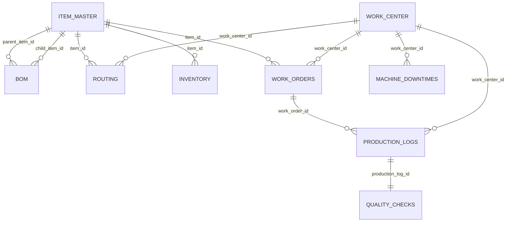

# SmartMES Backend - Technical Overview

## 1. Tech Stack

### Core Platform
- Language: Java 17
- Build tool: Maven
- Framework: Spring Boot 3.4.x
- Runtime model: REST API + WebSocket (STOMP/SockJS)

### Main Spring Modules
- Spring Web: REST controllers
- Spring Data JPA (Hibernate): ORM and persistence
- Spring Security: authentication/authorization
- Spring Validation: request validation support
- Spring WebSocket: real-time event push
- Spring Actuator: operational metrics/health
- Spring Data Redis: dependency included (no strong runtime usage found in current business flow)

### Data & API
- Database: PostgreSQL
- API documentation: springdoc-openapi (Swagger UI)
- Auth token: JWT (jjwt 0.11.5)
- Utility: Lombok

### Deployment Runtime (current repo)
- Dockerfile uses Eclipse Temurin JDK 17
- docker-compose exposes backend on port 8080

## 2. Architecture & Folder Structure

### Architectural Style
- Modular monolith, organized by business domain under `modules/*`
- Layering inside each domain: `controller -> service -> repository -> entity`
- Shared cross-cutting concerns in `core/*` (common base entity, config, exception handling)

### Main Source Layout
- `src/main/java/com/smartmes/backend/MesBackendApplication.java`
	- Spring Boot entrypoint, JPA auditing enabled

- `src/main/java/com/smartmes/backend/core/common`
	- `BaseEntity`: common fields for most domain tables (`id`, `tenantId`, audit timestamps, soft-delete flag)

- `src/main/java/com/smartmes/backend/core/config`
	- CORS config
	- OpenAPI/Swagger metadata

- `src/main/java/com/smartmes/backend/core/exception`
	- Global exception mapping to HTTP status codes

- `src/main/java/com/smartmes/backend/modules/auth`
	- JWT auth filter/service, Spring Security config
	- Login and user management endpoints

- `src/main/java/com/smartmes/backend/modules/masterdata`
	- Master definitions: Item, BOM, Routing, Work Center, Worker, Machine downtime

- `src/main/java/com/smartmes/backend/modules/production`
	- Work Order lifecycle, progress logging, quality check, inventory consumption/receipt

- `src/main/java/com/smartmes/backend/modules/inventory`
	- On-hand stock query and manual adjustments

- `src/main/java/com/smartmes/backend/modules/realtime`
	- Real-time alerts and machine watchdog (offline detection)
	- WebSocket broker configuration

- `src/main/java/com/smartmes/backend/modules/dashboard`
	- Aggregated KPI endpoints for dashboard

- `src/main/java/com/smartmes/backend/modules/system`
	- Runtime key-value system settings and typed setting lookup service

## 3. Database Schema (Important Entities & Relationships)

### Shared Pattern
- Most core entities inherit from `BaseEntity`:
	- `id`
	- `tenant_id`
	- `created_at`, `updated_at`
	- `created_by`, `updated_by`
	- `is_deleted`

### Key Tables
- `system_users` (`UserAccount`)
	- User login identity, role, full name, tenant context

- `item_master` (`ItemMaster`)
	- Material/product master data
	- Supports dynamic attributes via PostgreSQL JSONB (`custom_attributes`)

- `bom` (`Bom`)
	- Product recipe: parent item -> child material + quantity + scrap factor

- `routing` (`Routing`)
	- Process steps for item manufacturing, linked to work center

- `work_center` (`WorkCenter`)
	- Machines/lines/workstations and operational status

- `machine_downtimes` (`MachineDowntime`)
	- Machine incident records (start/end time, reason)

- `inventory` (`Inventory`)
	- On-hand stock per item and tenant

- `work_orders` (`WorkOrder`)
	- Planned and actual production order state

- `production_logs` (`ProductionLog`)
	- Each production progress report for a work order

- `quality_checks` (`QualityCheck`)
	- QC result associated to one production log

- `system_alerts` (`SystemAlert`)
	- Real-time alert persistence (read/unread)

- `system_settings` (`SystemSetting`)
	- Runtime business thresholds/flags in key-value format

- `master_workers` (`Worker`)
	- Worker records (this entity does not currently extend `BaseEntity`)

### Main Relationships
- `Bom.parentItem` many-to-one `ItemMaster`
- `Bom.childItem` many-to-one `ItemMaster`
- `Routing.item` many-to-one `ItemMaster`
- `Routing.workCenter` many-to-one `WorkCenter`
- `Inventory.item` many-to-one `ItemMaster`
- `WorkOrder.item` many-to-one `ItemMaster`
- `WorkOrder.workCenter` many-to-one `WorkCenter` (optional)
- `ProductionLog.workOrder` many-to-one `WorkOrder`
- `ProductionLog.workCenter` many-to-one `WorkCenter`
- `QualityCheck.productionLog` one-to-one `ProductionLog`
- `MachineDowntime.workCenter` many-to-one `WorkCenter`

### Relationship Summary (ER view)

## 4. API Endpoints (By Module)

### Auth & User
- `POST /api/v1/auth/login`
	- Username/password authentication, sets `access_token` + `refresh_token` HttpOnly cookies and returns user metadata
- `POST /api/v1/auth/refresh`
	- Validates `refresh_token` cookie, rotates both auth cookies, returns 200 when refresh succeeds
- `POST /api/v1/auth/logout`
	- Clears all auth cookies (`access_token`, `refresh_token`, and legacy `auth_token`)
- `GET /api/v1/users`
	- List users (admin-restricted)
- `POST /api/v1/users`
	- Create user (admin-restricted)
- `PATCH /api/v1/users/{id}/reset-password`
	- Reset user password (admin-restricted)
- `DELETE /api/v1/users/{id}`
	- Delete user (admin-restricted)

### Dashboard
- `GET /api/v1/dashboard/stats`
	- KPI summary: work order totals, completion rate, top inventory items

### Master Data
- Item master:
	- `POST /api/v1/master-data/items`
	- `GET /api/v1/master-data/items`

- BOM:
	- `POST /api/v1/master-data/boms`
	- `GET /api/v1/master-data/boms/{parentItemId}`

- Work center:
	- `POST /api/v1/master-data/work-centers`
	- `GET /api/v1/master-data/work-centers`
	- `GET /api/v1/master-data/work-centers/active`
	- `POST /api/v1/master-data/work-centers/{id}/down?reason=...`
	- `PATCH /api/v1/master-data/work-centers/{id}/resolve`
	- `PATCH /api/v1/master-data/work-centers/{id}/ping`

- Routing:
	- `POST /api/v1/master-data/routings`
	- `GET /api/v1/master-data/routings/item/{itemId}`

- Worker:
	- `GET /api/v1/master-data/workers`
	- `POST /api/v1/master-data/workers`

### Production
- `POST /api/v1/production/work-orders`
	- Create work order and compute planned end date from routing lead-time
- `PATCH /api/v1/production/work-orders/{id}/progress`
	- Submit production progress with pass/fail quantities and QC data
- `GET /api/v1/production/work-orders/{id}/logs`
	- Get production report history of one work order
- `GET /api/v1/production/work-orders`
	- Get all work orders for current tenant

### Inventory
- `GET /api/v1/inventory`
	- Get stock list
- `POST /api/v1/inventory/adjust?itemId=...&amount=...`
	- Manual stock adjustment (positive/negative, with non-negative check)

### Realtime Alerts
- `GET /api/v1/realtime/alerts/unread`
- `PATCH /api/v1/realtime/alerts/{id}/read`
- `GET /api/v1/realtime/alerts`

### System Settings
- `GET /api/v1/settings`
- `POST /api/v1/settings`

## 5. Core Business Logic (Most Complex Flows)

### Flow A: Production Progress Update (WorkOrderService.updateProgress)
Purpose: atomically process production report + QC + inventory mutation + alerting + state transitions.

High-level steps:
1. Validate work order exists and is not completed/cancelled.
2. Validate selected work center and reject if machine is `DOWN` or `OFFLINE`.
3. Validate quantity consistency: `passed + failed = completed` and cumulative output does not exceed plan.
4. Inventory effects:
	 - Increase finished good stock by `passedQuantity`.
	 - Decrease each BOM child stock by:
		 - `bom.quantity * completedQuantity * (1 + scrapFactor)`
5. Persist `ProductionLog` and nested `QualityCheck`.
6. Trigger QC alerts when defect rate crosses configurable threshold (`MAX_NG_RATE`).
7. Update work order status and machine status:
	 - In progress -> `IN_PROGRESS` and machine `RUNNING`
	 - At plan completion -> `COMPLETED` or remains `IN_PROGRESS` based on setting `AUTO_CLOSE_WO`
8. Publish dashboard update event via WebSocket topic.

Why this is critical:
- It coordinates multiple bounded contexts (production, quality, inventory, realtime alerts, system settings) in one transaction boundary.

### Flow B: Machine Downtime + Watchdog Recovery Cycle
Components: `WorkCenterService` + `MachineWatchdogService` + `AlertService`

Manual incident path:
1. Operator reports machine down (`/down`).
2. System sets machine status to `DOWN`.
3. System writes `MachineDowntime` record with start time and reason.
4. Real-time emergency alert is broadcast and persisted.

Resolution path:
1. Supervisor resolves issue (`/resolve`).
2. System closes active downtime record (`endTime`).
3. Machine status returns to `IDLE`.
4. Recovery alert is broadcast.

Automatic watchdog path:
1. Scheduler runs every 60 seconds.
2. Any machine with stale heartbeat (`lastPingAt` older than threshold) becomes `OFFLINE`.
3. Offline alert is sent in real time.
4. When heartbeat (`/ping`) returns, status can recover to `IDLE` and emits network recovery alert.

Why this is critical:
- It provides hybrid event handling (manual + scheduled + realtime) for shop-floor reliability.

## 6. Configuration & Environment

### Required Environment Variables
From `application.yml` and runtime wiring:
- `SERVER_PORT`
- `POSTGRESQL_HOST`
- `POSTGRESQL_PORT`
- `POSTGRESQL_DATABASE`
- `POSTGRESQL_USERNAME`
- `POSTGRESQL_PASSWORD` (secret)
- `JWT_SECRET` (secret, Base64 key for HS256 signing)
- `COOKIE_SECURE` (optional, default `false`; set `true` on HTTPS environments)
- `DOMAIN` (allowed CORS origin for security layer)

### Database Connectivity
- JDBC URL pattern: `jdbc:postgresql://${POSTGRESQL_HOST}:${POSTGRESQL_PORT}/${POSTGRESQL_DATABASE}`
- Hibernate dialect: PostgreSQL
- DDL mode currently configured as `update`

### Realtime & External Service Connectivity
- WebSocket endpoint: `/ws-mes` (SockJS enabled)
- Broker topics used by backend:
	- `/topic/alerts`
	- `/topic/dashboard`

### Security Configuration Notes
- Stateless JWT authentication with custom `JwtAuthFilter`
- Access token and refresh token are separated into two HttpOnly cookies:
	- `access_token`: short-lived, used by request authentication filter
	- `refresh_token`: longer-lived, used only by `/api/v1/auth/refresh`
- Refresh flow rotates both tokens on each successful refresh to reduce replay window
- Legacy cookie cleanup is handled on logout for backward compatibility with earlier auth model
- Public paths include auth + websocket handshake + swagger docs
- Role-protected areas include users/settings management

### Sensitive Data Handling Guidance
- Do not commit `.env` or plaintext credentials.
- Rotate `JWT_SECRET` per environment.
- Move any hardcoded bootstrap credentials or tenant constants to secure seeded config/migration scripts.

---

## Current Technical Caveats (For Future AI Context)
- Multi-tenant context is still hardcoded (`TENANT_01`) in many controllers/services; not fully extracted from JWT claims.
- Some entities use `BaseEntity` while `Worker` currently does not, leading to audit/soft-delete inconsistency.
- Repository-level tenant/soft-delete filtering is not uniformly enforced (some service code filters in-memory).
- A default admin bootstrap exists in auth initialization; should be replaced by controlled migration/seed strategy.
